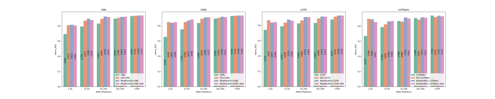

# KSI framework
This repository is forked from https://github.com/tiantiantu/KSI and extends the source code for the Knowledge Source Intergration (KSI) framework described in the following paper:
* **Bai, T., Vucetic, S., Improving Medical Code Prediction from Clinical Text via Incorporating Online Knowledge Sources, The Web Conference (WWW'19), 2019.**

## 1 - Setup
### 1.1 - Requirements
All dependencies are documented in the `requirements.txt`.

Before running the code, you need to apply for [MIMIC-III](https://mimic.physionet.org/gettingstarted/access/) dataset and place the files "NOTEEVENTS.csv" and "DIAGNOSES_ICD.csv" under the `/data` directory of the project.

The Wikipedia articles for ICD-9 codes are already provided under `/data` in the [`wikipedia_knowledge`](data/wikipedia_knowledge) file, taken from the original repository.

### 1.2 - Data Preprocessing

Afterwards, to build the datasets, run [`build_datasets.py`](build_datasets.py) from the root directory of the project. This will generate three datasets under `/data` containing:
* the dataset in its original form from the original repo
* a modified version of that dataset that supports multiple Wiki articles associated to a code rather than just one article per code
* a version of the dataset using normalized count vector representations of text rather than binary vectors encoding word presence. Meant to be used with the `ModifiedKSI` mechanism.
* a version of the dataset using tf-idf vector representations of text rather than binary vectors encoding word presence. Meant to be used with the `ModifiedKSI` mechanism.

For more flexibility, you can also use the individual preprocessing scripts, based off of the scripts in the original repo. The order is:
1. [`preprocess_mimic.py`](preprocess_mimic.py)
2. [`vectorize_mimic.py`](vectorize_mimic.py)
3. [`preprocess_final.py`](preprocess_final.py)

### 1.3 -  Different External Knowledge Sources
You can also rebuild the datasets using different external knowledge sources. To that end, [`wiki_scraper.ipynb`](`wiki_scraper.ipynb`) is a Jupyter notebook that scrapes Wikipedia to build an updated dataset of Wiki articles associated with ICD-9 codes. A sample output is available under `/data` as [`wikipedia_knowledge2`](data/wikipedia_knowledge_2). It can be used in place of the originally provided [`wikipedia_knowledge`](data/wikipedia_knowledge) file.

## 2 - Running the Models

Pretrained models are included in the `data` directory. Example usage can be seen in [`results.ipynb`](results.ipynb). Note that saved `torch` models do not save their model definitions, so you will need to import them from [`KSI_models.py`](KSI_models.py) first.

To train the models yourself, run the Jupyter notebooks below. Each notebook is dedicated to a single baseline classifier model, and evaluates:
1. Performance of the baseline alone
2. Performance of the baseline with the KSI mechanism
3. Performance of the baseline with a modified KSI mechanism over text representations that encode word frequencies, not just word presence as in the original paper
4. Performance of the baseline with a modified KSI mechanism over tfidf text representations

Four baselines are implemented, as in the original paper:
1. `KSI_CNN.ipynb` - CNN baseline classifier 
2. `KSI_CAML.ipynb` - CAML baseline classifier ([Mullenbach et al., 2018](https://arxiv.org/abs/1802.05695))
3. `KSI_LSTM.ipynb` - LSTM baseline classifier
4. `KSI_LSTMattn.ipynb` - LSTM w/ attention baseline classifier

This is a total of 16 models.

## 3 -  Evaluation & Results

Metrics for the included trained models are shown below. 

| Model                       | Recall@10 | Micro-F1 | Macro-F1 | Micro-AUC | Macro-AUC |
|-----------------------------|-----------|----------|----------|-----------|-----------|
| CNN                         | 0.796     | 0.655    | 0.253    | 0.975     | 0.850     |
| KSI+CNN                     | 0.795     | 0.648    | 0.257    | 0.977     | 0.892     |
| ModifiedKSI+CNN             | 0.807     | 0.657    | 0.302    | 0.980     | 0.906     |
| ModifiedKSI+CNN, tfidf      | 0.806     | 0.655    | 0.316    | 0.980     | 0.900     |
|-----------------------------|-----------|----------|----------|-----------|-----------|
| CAML                        | 0.804     | 0.658    | 0.243    | 0.976     | 0.835     |
| KSI+CAML                    | 0.803     | 0.645    | 0.236    | 0.978     | 0.891     |
| ModifiedKSI+CAML            | 0.807     | 0.648    | 0.278    | 0.980     | 0.901     |
| ModifiedKSI+CAML, tfidf     | 0.808     | 0.641    | 0.268    | 0.980     | 0.904     |
|-----------------------------|-----------|----------|----------|-----------|-----------|
| LSTM                        | 0.714     | 0.583    | 0.081    | 0.965     | 0.822     |
| KSI+LSTM                    | 0.762     | 0.593    | 0.189    | 0.974     | 0.880     |
| ModifiedKSI+LSTM            | 0.794     | 0.623    | 0.244    | 0.980     | 0.900     |
| ModifiedKSI+LSTM, tfidf     | 0.789     | 0.614    | 0.248    | 0.979     | 0.896     |
|-----------------------------|-----------|----------|----------|-----------|-----------|
| LSTMattn                    | 0.824     | 0.685    | 0.259    | 0.980     | 0.855     |
| KSI+LSTMattn                | 0.776     | 0.612    | 0.210    | 0.975     | 0.880     |
| ModifiedKSI+LSTMattn        | 0.812     | 0.648    | 0.248    | 0.981     | 0.906     |
| ModifiedKSI+LSTMattn, tfidf | 0.797     | 0.626    | 0.248    | 0.980     | 0.898     |

Performance by ICD-9 code frequency is plotted below.

To evaluate results for each model yourself, run the included notebook [`results.ipynb`](results.ipynb), changing the `model` argument as appropriate to one of `CNN`, `CAML`, `LSTM`, or `LSTMatt`. 
